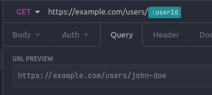
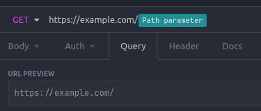
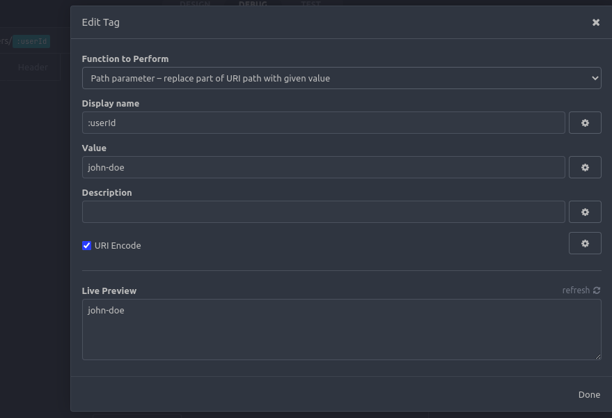
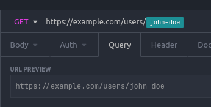
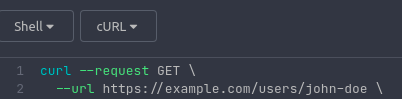

# Insomnia plugin - Path parameter tag

A template tag, that can be used inside URIs as path parameters.  

## Usage

Add the plugin to Insomnia by its name: "insomnia-plugin-path-parameter-tag".  

Create/edit a request, and when you want a path parameter:
* either press ctrl+space to insert the "Path parameter" tag
* or type ``, which does the same.

Here's an example of a URI with the value of `https://example.com/`.  

Click on the tag to edit its Value and optionally Display name.  

Only "Value" is required - this will be sent with the request.
Here's the URI and CURL previews with the request above, and a value set:  

"Description" is not sent anywhere, and is there only for documentation purpose.  

"Display name" is also not sent anywhere, but you can use it to configure the look of the tag in Insomnia UI.  

## Migration from `:param` style parameters

No automated way, but there's a workaround to quickly replace all of `:param` style parameters to use this tag instead - throughout all workspaces:
1. Close Insomnia.
2. Open `{insomnia-config-directory}/insomnia.Request.db` (see [Insomnia docs][docs-config-location] on where the directory is).
3. Do a regex replace: from `(?<=/)(:\w+)` to `` (this replaces anything that looks like `/:param` to become `/`.
4. Save the file, open Insomnia.

Limiting this transformation to only one project would probably involve exporting the project, and doing the same on the export data only, then reimporting.

[docs-config-location]: https://docs.insomnia.rest/insomnia/application-data